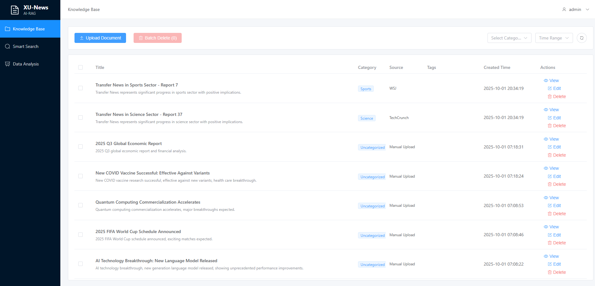
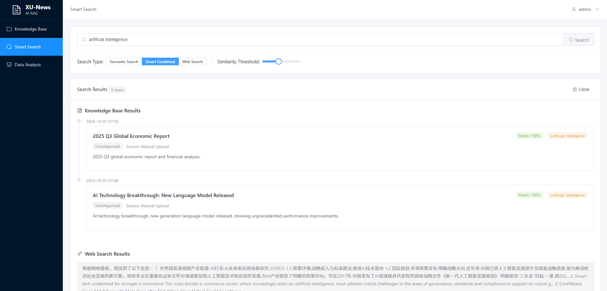
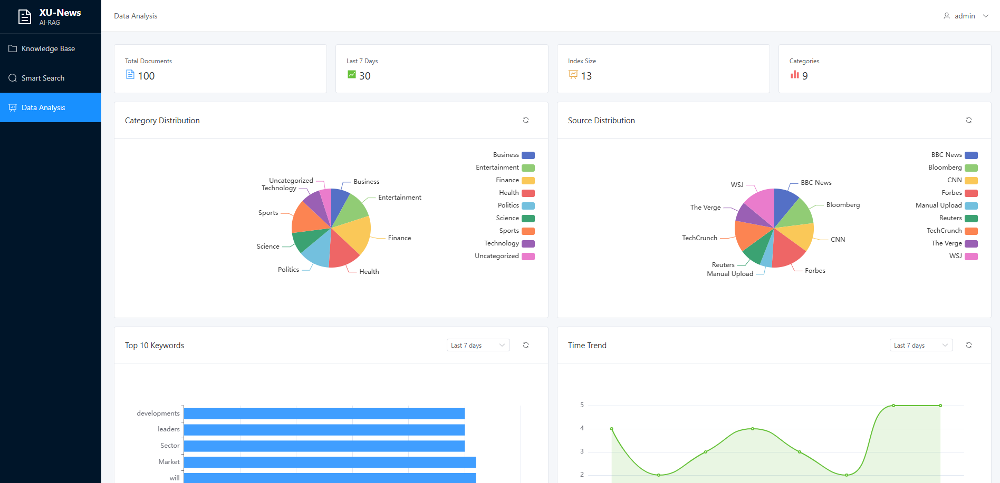

# 🗞️ XU AI News RAG

Intelligent News Information Retrieval System Based on SQLite

---

## 📸 Screenshots

### Knowledge Base Management

*Document upload, edit, delete, and categorization with full English interface*

### Smart Search

*Full-text search with keyword matching and web search integration*

### Data Analysis

*Comprehensive analytics with charts, trends, and English keywords extraction*

---

## 📋 Project Introduction

XU AI News RAG is an intelligent news information management and retrieval system that supports document upload, full-text search, web search, and data analysis.

### Core Features

- ✅ **Knowledge Base Management** - Document upload, edit, delete, categorization
- ✅ **Intelligent Search** - Full-text search based on SQLite + jieba
- ✅ **Web Search** - Integrated with Baidu Qianfan AI Search
- ✅ **Data Analysis** - Statistics charts, source distribution, trend analysis
- ✅ **n8n Integration** - Automatic news crawling and storage

### Tech Stack

**Backend:**
- Python 3.12 + Flask
- SQLite Database
- JWT Authentication
- jieba Chinese Word Segmentation
- Baidu Qianfan AI Search

**Frontend:**
- Vue 3 + Vite
- Element Plus UI
- Pinia State Management

---

## 🚀 Quick Start

### Requirements

- Python 3.8+
- Node.js 14+
- pip / npm

### Installation Steps

#### 1. Install Backend Dependencies

```bash
cd backend
pip install -r requirements.txt
```

#### 2. Install Frontend Dependencies

```bash
cd frontend
npm install
```

#### 3. Start Services

```bash
# Backend (new terminal)
cd backend
python app.py

# Frontend (new terminal)
cd frontend
npm run dev
```

#### 4. Access the System

- **Frontend**: http://localhost:3000
- **Backend API**: http://localhost:5000
- **Test Page**: http://localhost:3000/test-search.html

### Default Account

- Username: `admin@example.com`
- Password: `admin123`

---

## 📚 Documentation Navigation

### Core Documents

| Document | Description |
|----------|-------------|
| `PRD.md` | Product Requirements Document |
| `N8N_SIMPLE_SETUP.md` | n8n Auto-crawling Configuration |

### Backend Documentation

| Document | Location | Description |
|----------|----------|-------------|
| `README.md` | backend/ | Backend Project Description |
| `QUICKSTART.md` | backend/ | Quick Start Guide |
| `API_EXAMPLES.md` | backend/ | API Usage Examples |
| `env.baidu_search` | backend/ | Environment Variable Template |

### Frontend Documentation

| Document | Location | Description |
|----------|----------|-------------|
| `README.md` | frontend/ | Frontend Project Description |
| `QUICKSTART.md` | frontend/ | Quick Start Guide |

---

## 🎯 Main Features

### 1. Knowledge Base Management

- Upload documents (supports PDF, DOCX, TXT, MD, XLSX)
- Document editing (title, summary, category, tags)
- Batch deletion
- Category filtering
- Time range filtering

### 2. Intelligent Search

**Based on SQLite Full-Text Search:**
- jieba Chinese word segmentation
- Keyword matching
- Match score calculation
- Search history recording

**Search Types:**
- Semantic search (knowledge base)
- Smart combined (knowledge base + web search)
- Web search (Baidu Qianfan AI)

### 3. Data Analysis

- Document statistics
- Source distribution
- Category distribution
- Keyword cloud
- Time trends

### 4. n8n Integration

- Webhook endpoint without authentication
- Automatic news crawling
- Batch data import

---

## ⚙️ Configuration

### Backend Configuration

Create `.env` file in `backend/` directory (optional):

```bash
# Baidu Qianfan Search (optional, uses mock data if not configured)
SEARCH_API_KEY=Your_AppBuilder_API_Key
SEARCH_API_URL=https://qianfan.baidubce.com/v2/ai_search/web_search

# Other configurations
MAX_SEARCH_RESULTS=10
```

Reference template: `backend/env.baidu_search`

### n8n Webhook Configuration

**Endpoint:**
```
http://localhost:5000/api/documents/webhook/n8n
```

**Method:** POST

**Request Body:**
```json
{
  "title": "Article Title",
  "content": "Article Content",
  "summary": "Article Summary",
  "category": "Category",
  "source_url": "Source URL"
}
```

Detailed configuration: See `N8N_SIMPLE_SETUP.md`

---

## 🧪 Testing

### Test Scripts

Core test script included:

```bash
# Test Baidu Qianfan Search
python backend/test_qianfan_search.py
```

### Unit Tests

```bash
cd backend
pytest tests/
```

### Frontend Test Page

Visit: http://localhost:3000/test-search.html

---

## 📂 Project Structure

```
xu-ai-news-rag/
├── backend/                    # Backend code
│   ├── routes/                 # API routes
│   │   ├── auth.py            # Authentication
│   │   ├── documents.py       # Document management
│   │   ├── search.py          # Search
│   │   └── analysis.py        # Data analysis
│   ├── services/              # Business services
│   │   ├── document_parser.py # Document parsing
│   │   ├── search_service.py  # Search service
│   │   └── analysis_service.py# Analysis service
│   ├── instance/              # Database
│   │   └── xu_news_rag.db    # SQLite database
│   ├── uploads/               # Uploaded files
│   ├── app.py                # Main application
│   ├── models.py             # Data models
│   ├── config.py             # Configuration
│   └── requirements.txt      # Python dependencies
│
├── frontend/                  # Frontend code
│   ├── src/
│   │   ├── views/            # Page components
│   │   ├── layouts/          # Layouts
│   │   ├── router/           # Routing
│   │   ├── stores/           # State management
│   │   ├── api/              # API interfaces
│   │   └── utils/            # Utility functions
│   ├── public/               # Static resources
│   └── package.json          # npm dependencies
│
├── PRD.md                    # Product requirements document
└── N8N_SIMPLE_SETUP.md        # n8n configuration guide
```

---

## 🔧 Development Notes

### Database

Using SQLite, located at `backend/instance/xu_news_rag.db`

**Tables:**
- `users` - User table
- `documents` - Document table
- `search_history` - Search history

### API Endpoints

View complete API documentation: `backend/API_EXAMPLES.md`

**Core Endpoints:**
- `POST /api/auth/login` - Login
- `GET /api/documents/` - Get document list
- `POST /api/documents/upload` - Upload document
- `POST /api/search/semantic` - Intelligent search
- `POST /api/search/web` - Web search
- `POST /api/documents/webhook/n8n` - n8n Webhook

---

## 🌟 Key Features

### 1. Intelligent Search Without FAISS

Full-text search based on SQLite:
- jieba Chinese word segmentation
- Keyword extraction
- Match score calculation
- Lightweight deployment

### 2. n8n Integration Without Authentication

Webhook endpoint designed for n8n:
- No JWT Token required
- Supports single or batch import
- Automatic data cleaning

### 3. AI-Enhanced Search

Integrated with Baidu Qianfan AI Search:
- AI-enhanced search results
- Intelligent summary generation
- Recency filtering

---

## 📝 Changelog

### Latest Version (2025-10-01)

- ✅ Implemented SQLite-based full-text search
- ✅ Integrated Baidu Qianfan AI Search
- ✅ Fixed search history functionality
- ✅ Optimized frontend icons
- ✅ Added n8n Webhook endpoint

Detailed changelog: `backend/CHANGELOG.md`

---

## 🤝 Contributing

Issues and Pull Requests are welcome!

---

## 📄 License

MIT License

---

## 📧 Contact

For questions, please refer to project documentation or submit an Issue.

---

**Project completed and ready to use!** 🎉
